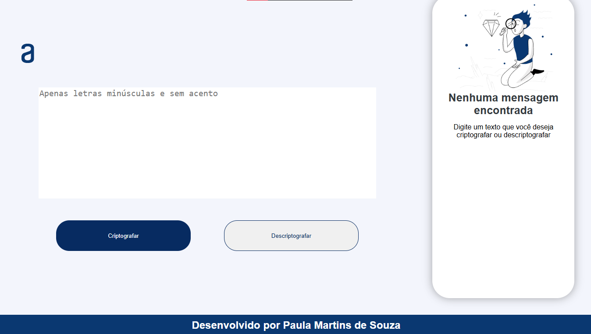

# README do Projeto: Challenge 1

 Este projeto consiste em uma página web que permite aos usuários criptografar e descriptografar mensagens. A interface foi desenvolvida para ser simples e intuitiva, com a funcionalidade adicional de copiar o texto resultante para a área de transferência. 

<h2> Funcionalidades</h2>
<li>Criptografar Texto: Transforma o texto de entrada em uma versão codificada.</li>
<li>Descriptografar Texto: Transforma o texto codificado de volta à sua forma original.</li>
<li>Copiar Texto: Permite ao usuário copiar o texto resultante para a área de transferência.</li>

<h2> Tecnologias Utilizadas </h2>

